# Module 1 — Logistic Regression & Classification Metrics
### A Reading Guide

> **How to use this guide.** This is a *standalone* reading guide: you can learn the whole module from this document alone. It explains every idea in plain language first, then shows the key mathematics and figures, and finally short Python snippets so you can see it in code. After reading this guide, open the two companion lab guides (`Guide01_lab_human-activity-recognition.md` and `Guide02_lab_clinical-nutrition-multinomial.md`) and the notebooks they walk through (`Guide01_Supervised-ML_Logistic-Regression_Introduction.ipynb` and `Guide02_Supervised-ML_Logistic-Regression_Case-Study.ipynb`) to practice on real data.
>
> **Who this is for.** Students with little or no programming background. Every code block is annotated line by line. You do not need to memorize the code — read it like a recipe and focus on understanding *what each step accomplishes and why*.
>
> **About the figures.** Each figure has a caption explaining exactly what to look for — read those captions; several carry ideas that appear nowhere else. If you want to regenerate or tinker with any figure, run `python make_figures.py` in this repo.
>
> **A note on the code blocks.** The snippets are *illustrative*, meant to be read rather than executed — several refer to variables like `X_train` or `y_test` that are created in the lab notebooks, not here. To actually run code, use the companion `.ipynb` labs, where everything is set up end to end.
>
> **What you need.** Python with the libraries `numpy`, `pandas`, `scikit-learn` (**version 1.8 or newer**), `matplotlib`, and `seaborn`. If you are using Google Colab or Anaconda, these are already installed. To install them yourself, run this once in a terminal: `pip install numpy pandas scikit-learn matplotlib seaborn`.

---

## Learning objectives

By the end of this guide you will be able to:

1. Explain the difference between **regression** and **classification**, and recognize which one a given problem calls for.
2. Describe *why* ordinary linear regression fails as a classifier, and how the **sigmoid (logistic) function** fixes it.
3. Interpret a logistic regression model through **odds** and **log-odds**, and read the meaning of a coefficient.
4. Extend a binary classifier to **many classes** using *one-vs-rest* and *multinomial (softmax)* strategies.
5. Train and tune a logistic regression model in **scikit-learn**, including **L1/L2 regularization** and the `C` hyperparameter.
6. Evaluate a classifier correctly using the **confusion matrix**, **accuracy, precision, recall, specificity, and F1**, and know when accuracy is misleading.
7. Read and use **ROC** and **precision–recall** curves, and understand what **AUC** measures.
8. Choose the right metric and averaging strategy for **multi-class** and **imbalanced** problems.

---

## Table of contents

1. [What is classification?](#1-what-is-classification)
2. [Why linear regression fails at classification](#2-why-linear-regression-fails-at-classification)
3. [The logistic (sigmoid) function](#3-the-logistic-sigmoid-function)
4. [Odds, log-odds, and interpreting coefficients](#4-odds-log-odds-and-interpreting-coefficients)
5. [The decision boundary](#5-the-decision-boundary)
6. [Multi-class classification](#6-multi-class-classification)
7. [Implementing logistic regression in scikit-learn](#7-implementing-logistic-regression-in-scikit-learn)
8. [Regularization: preventing overfitting](#8-regularization-preventing-overfitting)
9. [Why accuracy is not enough: the confusion matrix](#9-why-accuracy-is-not-enough-the-confusion-matrix)
10. [The core metrics: precision, recall, specificity, F1](#10-the-core-metrics-precision-recall-specificity-f1)
11. [ROC and precision–recall curves](#11-roc-and-precisionrecall-curves)
12. [Metrics for multi-class problems](#12-metrics-for-multi-class-problems)
13. [Choosing the right metric](#13-choosing-the-right-metric)
14. [Key takeaways](#14-key-takeaways)
15. [Glossary](#15-glossary)
16. [Practical decision guide: when errors cost different amounts](#16-practical-decision-guide-when-errors-cost-different-amounts) ← *the capstone: how practitioners actually decide*
17. [Self-check questions](#17-self-check-questions)

*(Front matter: a [notation cheat-sheet](#notation-cheat-sheet-keep-this-open-on-your-first-read) sits just below — glance at it whenever a symbol looks unfamiliar.)*

---

## Notation cheat-sheet (keep this open on your first read)

New to the symbols? Here is every piece of notation used in this guide, in one place. **You do not need to memorise these** — just glance back whenever a formula looks unfamiliar. Reading a formula slowly, symbol by symbol, is a skill that comes with practice.

| Symbol | Say it as | What it means |
|---|---|---|
| $x$, $x_j$ | "eks", "eks-jay" | an **input feature** (a predictor); $x_j$ is the $j$-th feature |
| $y$ | "why" | the **true label** we want to predict (e.g. 0 or 1) |
| $\hat{y}$ | "why-hat" | the model's **predicted** label |
| $\beta_0,\ \beta_j$ | "beta-zero", "beta-jay" | the model's **coefficients** (weights it learns); $\beta_0$ is the intercept |
| $z$ | "zee" | the **linear score** $\beta_0 + \beta_1 x_1 + \dots$ — just a weighted sum |
| $p,\ p(x)$ | "pee" | a **probability**, always between 0 and 1 |
| $\sigma(\cdot)$ | "sigma" | the **sigmoid** function that turns $z$ into a probability |
| $e$ | "Euler's number" | the constant $\approx 2.718$ (the base of natural growth) |
| $\ln(\cdot)$ | "natural log" | the **logarithm** base $e$; it undoes $e^{\,\cdot}$ |
| $\sum_j$ | "sum over j" | **add up** the terms as $j$ runs over its values |
| $\arg\max_k$ | "arg-max" | **which** $k$ gives the largest value (not the value itself) |
| $C_{FP},\ C_{FN}$ | | the **cost** of a false positive / of a false negative (Section 16) |
| $t^*$ | "tee-star" | the cost-optimal **decision threshold** (Section 16) |

> **Two words you'll meet constantly.** A **hyperparameter** is a setting *you* choose before training (like the penalty strength `C`), as opposed to a coefficient the model *learns* from the data. A **solver** is simply the optimisation algorithm that does the fitting behind the scenes.

---

## 1. What is classification?

Supervised learning — learning from labeled examples — splits into two big families depending on **what kind of answer you want**.

- **Regression** predicts *how much* — a continuous number. Examples: house price from square footage, monthly revenue from ad spend, or next-hour network load from recent traffic signals.
- **Classification** predicts *which class* — a category. Examples: fraud vs. not fraud (from predictors like transaction amount, time, merchant type, and location), churn vs. stay (from tenure, monthly charges, contract type, and support-call count), default vs. no default (from income, debt-to-income ratio, credit score, and past delinquencies), or one of six physical activities (from accelerometer and gyroscope signals).

If the target variable (the thing you are predicting) is a *quantity*, it is regression. If it is a *label* (yes/no, or one of several named groups), it is classification. Classification is not limited to two outcomes — you can predict among three, six, or a thousand classes, as long as each answer is a discrete category.

**Quick intuition:** regression answers "how much?" while classification answers "which bucket?" If your output can be listed as named categories, you are in classification territory.

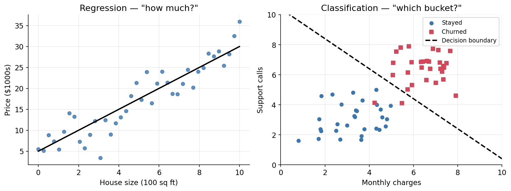

*Left: regression fits a line through a continuous outcome — the answer is a number anywhere along the y-axis. Right: classification separates labelled groups — the answer is which side of the boundary you fall on. Same data-driven spirit, fundamentally different output.*

**Many model families you will meet in this course have both classification and regression variants** (for example, decision trees and support vectors). This course focuses on classification:

| Model | One-line idea |
|---|---|
| **Logistic Regression** | Extends linear regression to output a probability between 0 and 1. *(This module.)* |
| **K-Nearest Neighbors (KNN)** | Labels a point by the majority vote of its closest neighbors. |
| **Support Vector Machines (SVM)** | Finds the boundary that separates classes with the widest margin; the *kernel trick* allows curved boundaries. |
| **Decision Trees** | Ask a sequence of yes/no questions to carve up the feature space. |
| **Random Forests / Boosting** | Combine many trees, but by *opposite* mechanisms — see the note below. |
| **Neural Networks** | Stack linear + non-linear steps to model very complex boundaries. |

> **Random Forests vs. Boosting — a distinction worth getting right early.** Both are ensembles of trees, but they work in opposite ways. **Random Forests** use *bagging*: many trees are trained **independently and in parallel** on random subsets of the data and features, and their votes are averaged — this mainly reduces **variance** (overfitting). **Boosting** (AdaBoost, Gradient Boosting, XGBoost) trains trees **sequentially**, each one correcting the errors left by the previous — this mainly reduces **bias** (underfitting). Remembering *parallel-and-average vs. sequential-and-correct* will save you confusion in the ensembles module.

We start with **logistic regression** because it is fast, interpretable, and the conceptual foundation for much of what follows (the softmax layer of a neural network is, quite literally, multinomial logistic regression).

---

## 2. Why linear regression fails at classification

> **Where we are.** We can now tell classification from regression. The natural next question: can we just reuse the straight-line model we already know? We try it — and watch it break, which motivates everything that follows.

It is tempting to reuse the linear regression you already know. Encode the two classes as the numbers `1` and `0`, fit a straight line, and then predict class `1` whenever the line's output is above `0.5` and class `0` otherwise. This *sometimes* works, but it has two serious flaws.

**Flaw 1 — the output is unbounded.** A straight line, $\hat{y} = \beta_0 + \beta_1 x$, can produce any value: 1.7, or −0.4. But a probability must live between 0 and 1. A prediction of "1.7" is meaningless as a probability, and there is nothing in the model stopping it.

**Flaw 2 — it is easily distorted by extreme points.** The `0.5` cutoff corresponds to a specific location on the line. Add a few points far from the boundary, and least-squares fitting tilts the whole line to accommodate them. That shifts the `0.5` crossing sideways and starts misclassifying points that were previously obvious — even in a case where the true boundary between the classes is visually clear.

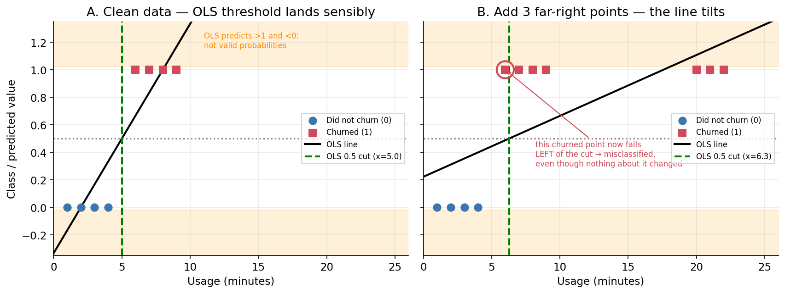

*Both flaws in one diagram. **Panel A:** with clean data the OLS line crosses 0.5 at x = 5.0, neatly between the two groups — but notice the line still runs off into the shaded bands where it predicts values above 1 and below 0, which are not valid probabilities (Flaw 1). **Panel B:** we add three churned customers far to the right. Nothing about the original points changed, yet the line tilts to accommodate the newcomers and the 0.5 crossing slides right to x = 6.3 — dragging the boundary past a churned customer at x = 6, which is now misclassified (Flaw 2). The extreme points, which the model should find easy, have corrupted a decision that was previously obvious.*

So we need a model that (a) outputs valid probabilities between 0 and 1, and (b) is trained with a classification-appropriate loss. Logistic regression does this with the **sigmoid link** plus **log-loss** (cross-entropy), instead of least squares.

**Intuition:** linear regression minimizes squared distance to labels 0 and 1, so extreme feature values can strongly tilt the fitted line. Logistic regression models class probability directly; uncertain or misclassified points drive learning, while confidently correct points contribute little extra change.

**30-second mental model:**
- Linear regression asks: "How do I draw the best line through points marked 0 and 1?"
- Logistic regression asks: "How likely is class 1 at this location?"
- Same linear score $z$, different goal and loss.

---

## 3. The logistic (sigmoid) function

> **Where we are.** Linear regression failed for two specific reasons. The sigmoid function fixes both — and it is the mathematical heart of logistic regression.

The sigmoid (also called the logistic function) takes *any* real number and squashes it into the open interval $(0, 1)$:

$$\sigma(z) = \frac{1}{1 + e^{-z}}$$

*In words: whatever number $z$ you put in, this hands back a value between 0 and 1 that we read as a probability. A big positive $z$ comes out near 1; a big negative $z$ comes out near 0.*

Here $z$ is the familiar linear combination of the features:

$$z = \beta_0 + \beta_1 x_1 + \beta_2 x_2 + \dots + \beta_p x_p$$

*In words: $z$ is just a weighted sum of the features plus an intercept — the exact same linear formula as ordinary regression. The sigmoid then wraps around it.*

Instead of fitting $y = \beta_0 + \beta_1 x$ directly (linear regression), logistic regression fits

$$p(x) = \sigma(\beta_0 + \beta_1 x) = \frac{1}{1 + e^{-(\beta_0 + \beta_1 x)}}$$

and interprets the output $p(x)$ as **the probability that the sample belongs to the positive class (class 1) or the negative class (class 0)**.

**Why this shape works.** The sigmoid is an "S" curve:

- When $z$ is a large positive number, $e^{-z} \to 0$, so $\sigma(z) \to 1$.
- When $z$ is a large negative number, $e^{-z} \to \infty$, so $\sigma(z) \to 0$.
- When $z = 0$, $\sigma(0) = \tfrac{1}{1+1} = 0.5$ — the natural 50/50 decision point.

Because the curve *saturates* (flattens) at both ends, predicted probabilities stay bounded and stable. Together with log-loss training, this addresses Flaw 1 (invalid probability outputs) and avoids the least-squares behavior behind Flaw 2.

**Tiny numeric check:**
- If $z = 2$, then $\sigma(z) \approx 0.88$ (strongly class 1).
- If $z = -2$, then $\sigma(z) \approx 0.12$ (strongly class 0).
- If $z = 0$, then $\sigma(z) = 0.5$ (exactly undecided).

> **Try it yourself.** Plug $z = 1$ into the formula: $\sigma(1) = 1 / (1 + e^{-1}) = 1 / 1.368 \approx 0.73$. So a linear score of 1 means "about 73% likely to be class 1." (You can check on a calculator: $e^{-1} \approx 0.368$.)

> **Important naming caution.** "Logistic *regression*" is a **classification** algorithm, despite the word "regression" in its name. The name is historical; do not let it confuse you.

**See it in code.** This snippet draws the sigmoid so you can connect the formula to the shape.

```python
import numpy as np                      # numerical arrays and math
import matplotlib.pyplot as plt         # plotting

z = np.linspace(-10, 10, 200)           # 200 evenly spaced values of z from -10 to 10
sigma = 1 / (1 + np.exp(-z))            # apply the sigmoid formula element-wise

plt.plot(z, sigma)                      # draw the S-curve
plt.axhline(0.5, ls='--', color='gray') # horizontal line at the 0.5 decision threshold
plt.axvline(0.0, ls='--', color='gray') # vertical line where z = 0
plt.xlabel('z  (the linear part:  β0 + β1·x)')
plt.ylabel('σ(z)  =  probability of class 1')
plt.title('The Sigmoid / Logistic Function')
plt.show()
```

Reading the plot: the vertical axis never leaves the range 0 to 1, and the curve crosses 0.5 exactly at `z = 0`. Everything to the right of that crossing is predicted class 1; everything to the left, class 0.

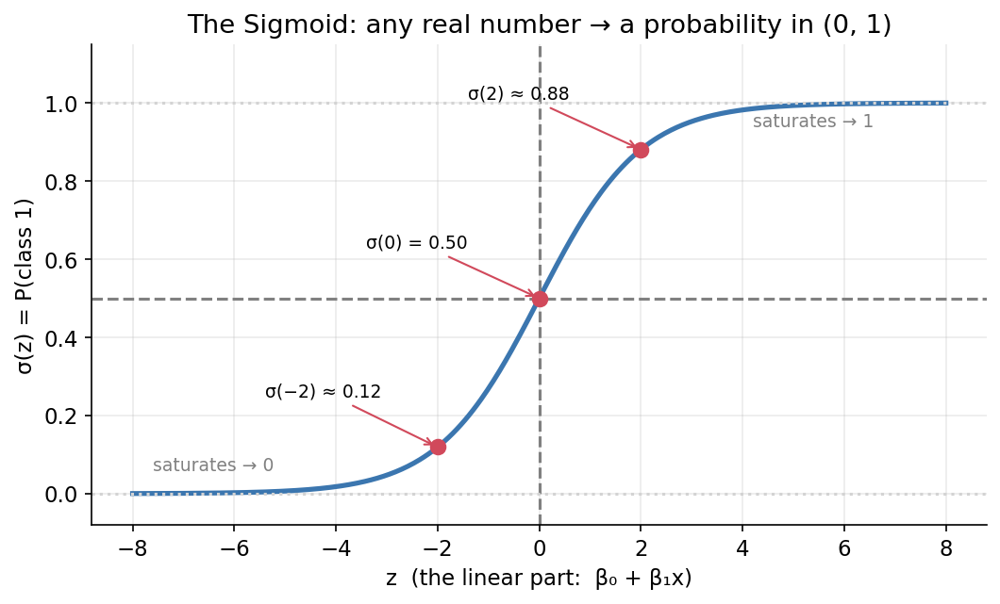

*The three marked points are the numeric examples above. Notice how the curve **saturates**: past about z = ±4 it is essentially flat. That flattening is what protects the model from Flaw 2 — pushing a point further out to the right barely changes its predicted probability, so extreme samples cannot drag the boundary around the way they did with the OLS line.*

### 3.1 Worked Scenario: Spam Detection (Counts -> Probability -> Log-Odds)

Suppose an email team reviews 399 messages and records what was truly spam versus not spam, along with what the filter predicted. From that audit, they get these four counts:

- True Positive (TP) = 321  (predicted spam, actually spam)
- True Negative (TN) = 58   (predicted not spam, actually not spam)
- False Positive (FP) = 12  (predicted spam, actually not spam)
- False Negative (FN) = 8   (predicted not spam, actually spam)

The goal in this mini-example is not model training yet; it is to practice translating counts into probability, odds, and log-odds.

First compute totals:

- Total emails: $N = TP + TN + FP + FN = 399$
- Actual spam emails: $TP + FN = 329$
- Actual not-spam emails: $TN + FP = 70$

Now convert this real scenario into probability, odds, and log-odds. We will reuse these same counts later when ROC and threshold-based evaluation are introduced.

**Step 1: Probability of spam (from actual labels)**

$$p(\text{spam}) = \frac{TP+FN}{N} = \frac{329}{399} \approx 0.825$$

So in this dataset, about 82.5% of emails are spam.

**Step 2: Odds of spam**

$$\text{odds}(\text{spam}) = \frac{p}{1-p} = \frac{0.825}{0.175} \approx 4.70$$

Interpretation: roughly 4.7 to 1 in favor of spam.

**Step 3: Log-odds of spam**

$$\log\text{-odds}(\text{spam}) = \ln\!\left(\frac{p}{1-p}\right) = \ln(4.70) \approx 1.55$$

This positive log-odds means spam is more likely than not-spam in this dataset.

**Code: compute the probability, odds, and log-odds**

```python
import numpy as np

# Given counts
TP, TN, FP, FN = 321, 58, 12, 8

# Probability, odds, log-odds from ACTUAL class counts
N = TP + TN + FP + FN
p_spam = (TP + FN) / N
odds_spam = p_spam / (1 - p_spam)
log_odds_spam = np.log(odds_spam)

print(f"P(spam)      = {p_spam:.3f}")
print(f"Odds(spam)   = {odds_spam:.3f}")
print(f"Log-odds     = {log_odds_spam:.3f}")
```

*These counts are enough to recover probability, odds, and log-odds. Save the ROC interpretation for Section 11, where thresholds and score-based curves are the main topic.*

---

## 4. Odds, log-odds, and interpreting coefficients

> **Where we are.** We can now output valid probabilities. This section shows the payoff that makes logistic regression so beloved: its coefficients are *interpretable* — each one tells a concrete story about odds.

One of logistic regression's greatest strengths is that its coefficients are **interpretable**. To see how, we transform the model with a little algebra.

Start from the sigmoid and note that $e^{-z} = \tfrac{1}{e^{z}}$. Multiplying numerator and denominator by $e^{z}$ gives an equivalent form:

$$p = \frac{1}{1 + e^{-z}} = \frac{e^{z}}{1 + e^{z}}$$

Now define the **odds** — the ratio of the probability of the event to the probability of no event:

$$\text{odds} = \frac{p}{1 - p} = \frac{\dfrac{e^{z}}{1+e^{z}}}{\dfrac{1}{1+e^{z}}} = e^{z} = e^{\beta_0 + \beta_1 x}$$

Take the natural log of both sides:

$$\boxed{\; \ln\!\left(\frac{p}{1-p}\right) = \beta_0 + \beta_1 x \;}$$

*In words: a transformed version of the probability (the "log-odds") is just a plain straight line in the features. All the curviness of the sigmoid disappears once you look at this scale.*

The left side, $\ln\!\big(\tfrac{p}{1-p}\big)$, is called the **log-odds** or **logit**. The equation says something remarkable: **the log-odds is a plain linear function of the features.** The non-linearity is entirely absorbed into the sigmoid, and underneath it, linear structure is preserved.

### 4.1 Odds ratio (OR): the practical interpretation

In linear regression, "a one-unit increase in $x$ raises $y$ by $\beta_1$." 

In logistic regression, a one-unit increase in $x_j$ changes **log-odds** by $\beta_j$.
Because log-odds are natural logs of odds, adding $\beta_j$ on the log scale means multiplying odds by $e^{\beta_j}$. So for a one-unit increase in $x_j$:

$$\text{OR} = e^{\beta_j}$$

*In words: to turn a coefficient into its effect on the odds, raise $e$ to that coefficient. A coefficient of 0 gives $e^0 = 1$ — i.e. multiply the odds by 1, meaning no effect.*

This number $e^{\beta_j}$ is the **odds ratio**.

- If $e^{\beta_j} > 1$, odds increase.
- If $e^{\beta_j} < 1$, odds decrease.
- If $e^{\beta_j} = 1$, no effect.

You can also compare larger changes:

$$\text{OR for }\Delta x_j = e^{\beta_j\Delta x_j}$$

So a 3-unit increase uses $e^{3\beta_j}$, not just $e^{\beta_j}$.

**Worked odds-ratio example (churn):**

Suppose the feature `support_call_count` has coefficient $\beta=0.7$.

1. One extra support call changes odds by $e^{0.7} \approx 2.01$.
2. Interpretation: each additional call is associated with about **2x higher churn odds** (holding other features fixed).
3. Two extra calls: OR $= e^{1.4} \approx 4.05$.

So odds can grow quickly even from moderate coefficients.

> **Try it yourself.** What if the coefficient were *negative*, say $\beta = -0.7$? Then the odds get multiplied by $e^{-0.7} \approx 0.50$ — each extra call would *halve* the odds instead. 

> Rule of thumb: a positive coefficient pushes the odds up, a negative one pulls them down, and $e^{\beta}$ is exactly how much.

### 4.2 Log-odds: why we model this instead of probability directly

**Log-odds** is

$$\text{log-odds} = \ln\!\left(\frac{p}{1-p}\right)$$

Why this is useful:

- Probability is bounded between 0 and 1.
- Log-odds can take any real value ($-\infty$ to $+\infty$).
- A linear model works naturally on an unbounded scale, so we model log-odds linearly and then convert back to probability with sigmoid.

**Worked log-odds example (end-to-end):**

Start with baseline churn probability $p_0 = 0.20$.

1. Convert probability to odds:
$$\text{odds}_0 = \frac{0.20}{0.80} = 0.25$$

2. Convert odds to log-odds:
$$\text{log-odds}_0 = \ln(0.25) \approx -1.386$$

3. Increase `support_call_count` by 1 with coefficient $\beta=0.7$:
$$\text{log-odds}_1 = -1.386 + 0.7 = -0.686$$

4. Convert back to odds:
$$\text{odds}_1 = e^{-0.686} \approx 0.503$$

5. Convert back to probability:
$$p_1 = \frac{0.503}{1+0.503} \approx 0.335$$

So probability moved from **0.20 to 0.335** after a +1 change in that feature. This shows a key point: coefficients are linear in log-odds, but their effect on probability is **nonlinear** and depends on the starting probability.

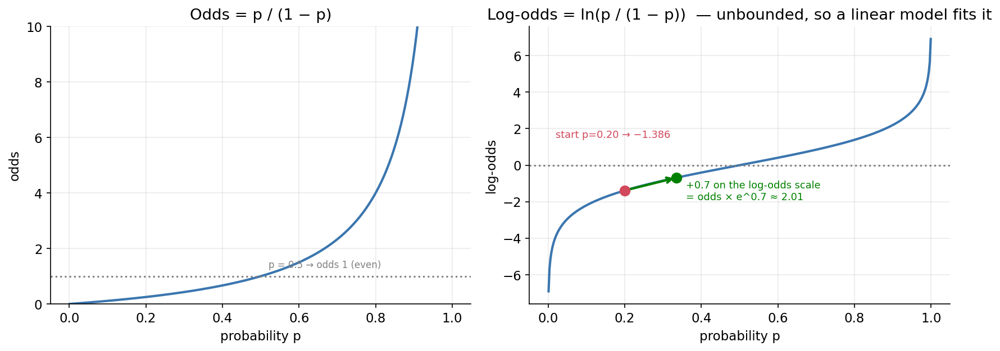

*The two translations that make logistic regression work. **Left:** odds explode toward infinity as p approaches 1, so odds alone are an awkward modelling target. **Right:** taking the log fixes that — log-odds run from −∞ to +∞, a scale on which a straight line is perfectly at home. The arrow traces the churn example exactly: start at p = 0.20 (log-odds −1.386), add the coefficient β = 0.7 for one extra support call, land at log-odds −0.686, and convert back to p = 0.335. Note the curve's **S-shape**: the same +0.7 nudge moves probability a lot near the middle and very little near the ends — which is precisely why coefficients are linear in log-odds but **non-linear in probability**.*

**Quick bridge summary:**
- Coefficients are easiest to read as **odds ratios** ($e^{\beta}$).
- The model is linear in **log-odds**.
- Predictions are usually reported as **probabilities** after applying sigmoid.

> **Learn more.** `scikit-learn` gives you coefficients but not their statistical p-values. If you need formal statistical inference (confidence intervals, significance tests), fit the model with the `statsmodels` package instead. `scikit-learn` is optimized for prediction; `statsmodels` for inference.

---

## 5. The decision boundary

> **Where we are.** We can score and interpret. Now, geometrically: where in the feature space does the model actually switch its answer from one class to the other?

The **decision boundary** is the set of feature values where the model is exactly undecided — where $p(x) = 0.5$, equivalently where $z = \beta_0 + \beta_1 x_1 + \dots = 0$.

- With **one feature**, the boundary is a single **point** on the number line.
- With **two features**, it is a **straight line** in the 2-D plane.
- With **many features**, it is a flat **hyperplane**.

The key fact: **logistic regression always has a *linear* decision boundary.** That is both its strength (simple, stable, interpretable) and its limitation (it cannot, on its own, carve out curved regions — later models like SVMs and trees can). To classify a new point, you check which side of the boundary it falls on.

**Visual cue:** think of the boundary as a "fence." Points on one side are predicted class 0; points on the other side are class 1.

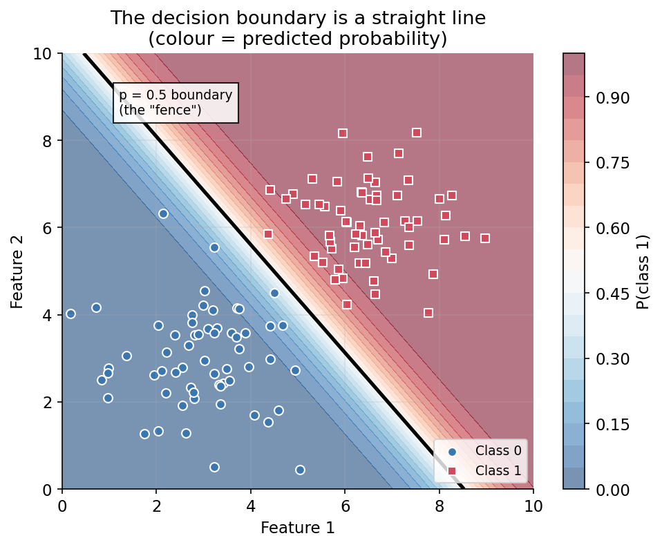

*Two features, so the boundary is a straight line (the black "fence"). The colour shows the predicted probability, and this is the part worth pausing on: the model does not just draw a fence, it produces a **smooth probability gradient**. Deep red and deep blue are regions of confidence; the pale band straddling the fence is where the model is genuinely unsure (p ≈ 0.5). Points near the boundary are the ones a real system might route to a human for review.*

---

## 6. Multi-class classification

> **Where we are.** Everything so far assumed two classes. But the Human Activity lab has *six*. Here is how the binary machinery scales up to three, six, or more.

Logistic regression is binary at heart, but two standard strategies extend it to $K > 2$ classes.

### 6.1 One-vs-Rest (OvR, also called One-vs-All)

Train **$K$ separate binary classifiers**. Classifier $k$ learns to separate "class $k$" from "everything else combined." To predict, run all $K$ classifiers and pick the class whose classifier is most confident.

- *Example (3 classes: churned, cancelled, competitor):* fit "churned vs. not," then "cancelled vs. not," then "competitor vs. not." Each produces its own probability; the largest wins.
- *Caveat:* OvR trains each class independently. Raw per-class confidence scores need not be jointly consistent, even if a library later normalizes them to sum to 1.

### 6.2 Multinomial (Softmax) logistic regression

Train **one joint model** that gives every class $k$ its own weight vector and score $z_k = \beta_k^\top x$, then converts all scores into a valid probability distribution with the **softmax** function:

$$P(y = k \mid x) = \frac{e^{z_k}}{\displaystyle\sum_{j=1}^{K} e^{z_j}}$$

*In words: give each class its own score, exponentiate every score so they are all positive, then divide each by the total. The results are guaranteed to be positive and to add up to 1 — exactly what a set of probabilities must do.*

The exponentials make every value positive, and dividing by their sum forces the probabilities to add up to 1. The prediction is $\hat{y} = \arg\max_k P(y = k \mid x)$ — the class with the highest probability.

In practical implementations, softmax is computed with a numerically stable shift (subtracting $\max_j z_j$ before exponentiating) so large scores do not overflow.

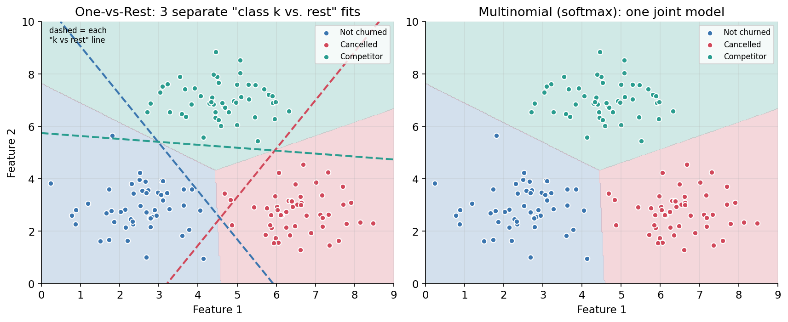

*Three classes, two strategies. **Left (OvR):** each dashed line is one independent "class k vs. everything else" fit — three separate binary problems, and a prediction is whichever classifier shouts loudest. **Right (multinomial):** one joint model carves the plane into three regions at once, with probabilities that sum to 1 everywhere. The shaded regions end up similar here because the classes are cleanly separated — the strategies diverge most when classes overlap or are imbalanced.*

**Which to use?** Prefer **multinomial** when the classes are *mutually exclusive* (each sample belongs to exactly one class) and you want calibrated probabilities that sum to 1. Prefer **OvR** when classes may overlap or when you specifically want independent per-class models. Softmax logistic regression is exactly the output layer of a classification neural network — a useful bridge to keep in mind for later courses.

---

## 7. Implementing logistic regression in scikit-learn

> **Where we are.** Enough theory to know *what* the model does. This is the short, four-step recipe you will run in every lab to make it happen.

The `scikit-learn` workflow is the same for almost every model: **import → instantiate → fit → predict**.

```python
from sklearn.linear_model import LogisticRegression   # 1. import the model class

# 2. instantiate (create) the model, choosing its settings ("hyperparameters")
lr = LogisticRegression(
    l1_ratio=0,        # 0 = L2 regularization, 1 = L1 (explained in Section 8)
    C=1.0,             # a common starting value; C is positive and is often tuned over a range such as 10^-4 to 10^4
    max_iter=1000      # how many optimization steps the solver may take
)

# 3. fit (train) the model on the TRAINING data
lr.fit(X_train, y_train)     # X_train = features, y_train = known labels

# 4a. predict hard class labels for new (test) data
y_pred = lr.predict(X_test)          # returns e.g. [1, 0, 0, 1, ...]

# 4b. predict class PROBABILITIES instead of hard labels
y_prob = lr.predict_proba(X_test)    # each row sums to 1, one column per class

# inspect the learned coefficients (one per feature; multiple rows if multi-class)
print(lr.coef_)
```

Two prediction methods matter, and the distinction is important later:

| Method | Returns | Use it for |
|---|---|---|
| `.predict(X)` | The single most likely class (a hard label) | Accuracy, precision, recall, F1, confusion matrix |
| `.predict_proba(X)` | A probability for *every* class (a soft score) | ROC-AUC, precision–recall curves, confidence thresholds |

Some metrics need hard labels; others need the probabilities. Keeping both on hand (as the lab notebooks do) saves you from recomputing.

**Applications beyond churn.** The same recipe predicts whether a customer will be a top-5% spender, whether a transaction is fraudulent, whether a loan will default, or which of six activities a phone's sensors are recording. Whenever the answer is a category, logistic regression is a strong, interpretable first model.

### 7.1 Mini runnable example

This example is fully self-contained. It uses a tiny synthetic dataset so you can run it exactly as written, without waiting for the lab notebooks.

```python
import numpy as np
from sklearn.model_selection import train_test_split
from sklearn.linear_model import LogisticRegression
from sklearn.metrics import accuracy_score, confusion_matrix

# Tiny toy dataset: one feature, binary label
X = np.array([[1.0], [1.5], [2.0], [2.5], [3.0], [3.5], [4.0], [4.5]])
y = np.array([0, 0, 0, 0, 1, 1, 1, 1])

# Split the data the same way you would for a real project.
# stratify=y keeps the class balance identical in the train and test halves.
X_train, X_test, y_train, y_test = train_test_split(
  X, y, test_size=0.25, random_state=42, stratify=y
)

# Train the model
model = LogisticRegression()
model.fit(X_train, y_train)

# Predict labels and probabilities
y_pred = model.predict(X_test)
y_prob = model.predict_proba(X_test)[:, 1]

print("Test predictions:", y_pred)
print("Test probabilities:", np.round(y_prob, 3))
print("Accuracy:", accuracy_score(y_test, y_pred))
print("Confusion matrix:\n", confusion_matrix(y_test, y_pred))

# Expected output (the test set here is just 2 rows):
#   Test predictions: [0 1]
#   Test probabilities: [0.322 0.818]
#   Accuracy: 1.0
#   Confusion matrix:
#    [[1 0]
#     [0 1]]
```

If you run it and see those numbers, it worked. The point is not the dataset itself; it is the pattern: split, fit, predict, and then inspect both labels and probabilities.

---

## 8. Regularization: preventing overfitting

> **Where we are.** We can train a model. But a model with 561 features can *memorise* the training data instead of learning from it. Regularization is the guardrail against that.

With many features (the Human Activity dataset has **561**), a model can "memorize" noise in the training data and then fail on new data — this is **overfitting**. **Regularization** fights this by adding a penalty for large coefficients to the loss the model minimizes. Two forms dominate:

| Penalty | Added to the loss | Effect on coefficients | Bonus behavior |
|---|---|---|---|
| **L2 (Ridge)** | $\lambda \sum_j \beta_j^2$ | Shrinks all coefficients smoothly toward zero | Keeps every feature (none become exactly 0); stable |
| **L1 (Lasso)** | $\lambda \sum_j \lvert\beta_j\rvert$ | Drives weak coefficients to **exactly zero** | Performs automatic **feature selection** (sparse model) |

**Elastic-Net** blends the two: $\lambda\big[\alpha \sum|\beta_j| + (1-\alpha)\sum \beta_j^2\big]$, where `l1_ratio` = $\alpha$ controls the mix. It is useful when features come in correlated groups.

**Choosing the penalty in `scikit-learn` (version 1.8 or newer).** You select the penalty with a single number, `l1_ratio`:

| You want | Code |
|---|---|
| L2 (Ridge), the default | `l1_ratio=0` |
| L1 (Lasso) | `l1_ratio=1` |
| Elastic-Net | `0 < l1_ratio < 1` (for example `0.5`) |
| No penalty | `C=np.inf` |

(`LogisticRegressionCV` takes a *list*, such as `l1_ratios=[1]`.) Older code and tutorials write `penalty='l1'`, `'l2'`, `'elasticnet'`, or `None` instead. That argument is deprecated in 1.8 and planned for removal in 1.10, and the old `multi_class=` argument was already **removed** in 1.8 (one-vs-rest is now written `OneVsRestClassifier(LogisticRegression(...))`, and multinomial is the default). **Do not run this on scikit-learn 1.7 or older:** there, `l1_ratio` is ignored unless `penalty='elasticnet'`, so an "L1" model would quietly be L2. Check with `import sklearn; print(sklearn.__version__)` and upgrade with `pip install -U scikit-learn`.

**The `C` hyperparameter — read this carefully.** In `scikit-learn`, you do not set $\lambda$ directly. You set `C`, which is its **inverse**: $C = 1/\lambda$. `C` must be a **positive** number; in practice it is often tuned on a logarithmic grid such as $10^{-4}$ to $10^{4}$ (and sometimes wider), because its effect changes rapidly across orders of magnitude.

- **Small `C` → strong regularization** (heavier penalty, simpler model).
- **Large `C` → weak regularization** (lighter penalty, closer to unregularized).

**Choosing `C` automatically.** `LogisticRegressionCV` tries several `C` values using *cross-validation* (repeatedly holding out a slice of the **training** data to score each candidate `C`, so you can tune without ever touching the test set) and keeps the best one:

```python
from sklearn.linear_model import LogisticRegressionCV

lr_cv = LogisticRegressionCV(
    Cs=10,               # try 10 values of C automatically
    cv=4,                # 4-fold cross-validation to score each C
    l1_ratios=[1],       # pure L1 here, for feature selection (0 would be pure L2)
    solver='saga',       # a solver that supports L1 for any number of classes
    scoring='accuracy'   # how each candidate C is scored
).fit(X_train, y_train)
```

> **Solvers matter.** Not every optimization algorithm supports every penalty (scikit-learn 1.8 or newer). `saga` supports L1, L2, and Elastic-Net for any number of classes. `liblinear` supports L1 and L2 for **binary** problems only (for more classes, wrap it in `OneVsRestClassifier`). `lbfgs` supports L2 or no penalty, but not L1. If you get a solver error, this pairing is usually why. An *unregularized* model uses `C=np.inf` with a solver such as `lbfgs`.

**A practical warning about correlated features.** When two features are highly correlated (say, "total fat" and "saturated fat"), L2 tends to *split* the weight between them, while L1 tends to *pick one and zero the other*. Neither is automatically "right" — but knowing this helps you interpret coefficients sensibly.

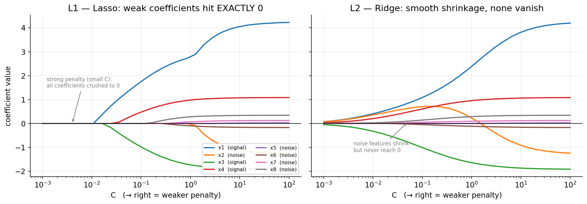

*This one picture contains most of Section 8. Each line is one feature's coefficient as we sweep `C` from a very strong penalty (left) to almost none (right). Four features carry real signal (x1, x3, x4 and the correlated x2); the other four are pure noise. **Left (L1/Lasso):** the noise coefficients sit pinned at **exactly zero** across the whole plot — that flat line *on* the axis is automatic feature selection happening. **Right (L2/Ridge):** the same noise features shrink but never quite arrive at zero. Read either panel right-to-left and you watch regularization tighten: at small `C` every coefficient is crushed toward zero, which is the model being forced to simplify. Look too at the correlated pair x1/x2 — L2 hands weight to both, while L1 largely favours one and suppresses the other, exactly as the warning above describes.*

---

## 9. Why accuracy is not enough: the confusion matrix

> **Where we are.** We can build and tune a classifier. Now the harder half of the job: is it actually *good*? The first lesson is that the obvious metric — accuracy — can lie to your face.

Suppose you build a classifier to detect a disease where **99% of patients are healthy**. A lazy model that *always* predicts "healthy" achieves 99% accuracy while being completely useless, because it never catches a single sick patient. This is the central lesson of classification evaluation: **on imbalanced data, accuracy lies.** You must look deeper.

The tool for looking deeper is the **confusion matrix**. For a binary problem, rows are the *true* class and columns are the *predicted* class:

|  | **Predicted: Positive** | **Predicted: Negative** |
|---|---|---|
| **Actual: Positive** | True Positive (TP) | False Negative (FN) — *Type II error* |
| **Actual: Negative** | False Positive (FP) — *Type I error* | True Negative (TN) |

- The **diagonal** (TP, TN) is where the model is **correct**.
- The **off-diagonal** (FP, FN) is where it makes **errors**, and the two kinds of error are *not* interchangeable:
  - A **False Positive (Type I)** is a false alarm — predicting positive when the truth is negative.
  - A **False Negative (Type II)** is a miss — predicting negative when the truth is positive.

Which error is worse depends entirely on the problem. Missing a cancer diagnosis (FN) is far more costly than a false alarm (FP) that a follow-up test can clear. The confusion matrix keeps these separate so you can reason about them.

**Mini worked example (100 cases):**
- TP = 18, FN = 2, FP = 10, TN = 70
- Accuracy = $(18+70)/100 = 0.88$
- Recall = $18/(18+2) = 0.90$
- Precision = $18/(18+10) \approx 0.64$

Same model, very different story depending on the metric.

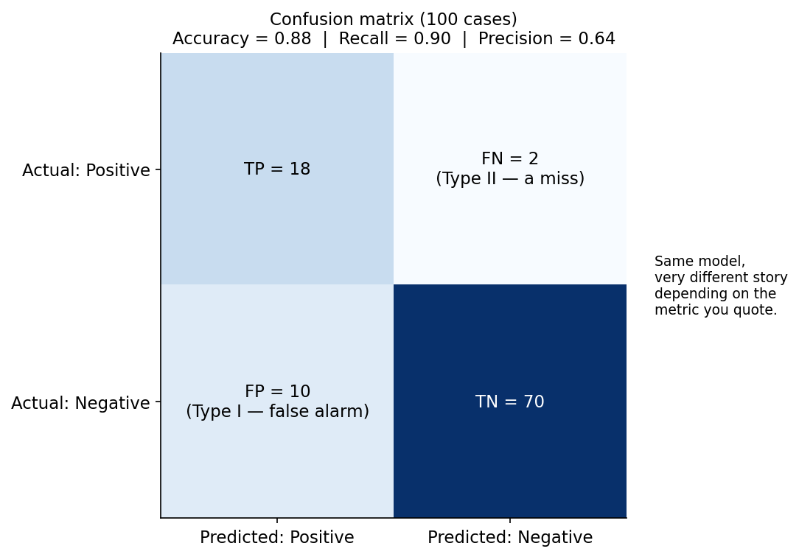

*The same 100 cases, laid out. Every metric in the next section is just a different way of slicing this one table: **accuracy** reads the whole grid, **recall** reads the top row only, and **precision** reads the left column only. Quote 0.88 and the model sounds solid; quote 0.64 and it sounds shaky. Both are true — which is exactly why you report more than one.*

---

## 10. The core metrics: precision, recall, specificity, F1

> **Where we are.** The confusion matrix gave us four raw counts. These five metrics turn those counts into answers to specific questions — each one asking something different.

Each metric answers a different question about the confusion matrix. Read each formula alongside its plain-English meaning.

**Accuracy** — overall fraction correct.

$$\text{Accuracy} = \frac{TP + TN}{TP + TN + FP + FN}$$

Good default *only when classes are balanced*; deceptive otherwise.

**Recall (Sensitivity / True Positive Rate)** — of all the *actual* positives, how many did we catch?

$$\text{Recall} = \frac{TP}{TP + FN}$$

This is the **capture rate**. In the disease example: of all truly sick patients, what fraction did we flag? You can trivially get 100% recall by predicting *everyone* is positive — so recall alone is not enough.

**Precision** — of all the cases we *predicted* positive, how many were truly positive?

$$\text{Precision} = \frac{TP}{TP + FP}$$

This is the **reliability** of a positive prediction. You can trivially get 100% precision by predicting positive only for the one case you are most certain about — so precision alone is not enough either.

**The precision–recall trade-off.** These two pull against each other. Flag more cases and you catch more true positives (recall up) but also raise false alarms (precision down). Flag fewer and precision rises while recall falls. Good evaluation watches *both*.

**Threshold intuition:** lowering the decision threshold usually increases recall and decreases precision; raising it usually does the opposite.

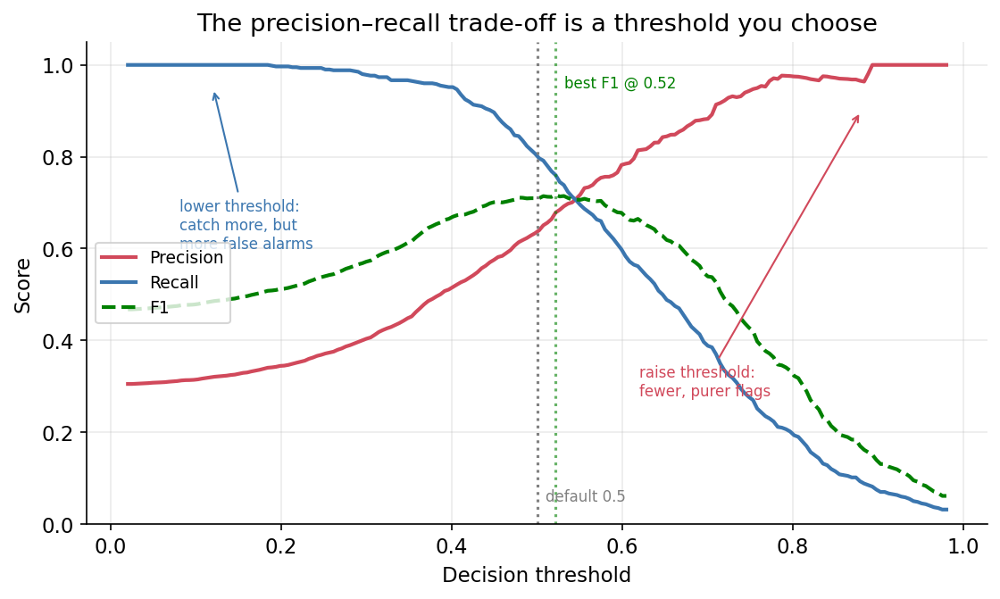

*The trade-off is not a law of nature — it is a **dial you control**. Sweep the threshold left and recall climbs while precision falls; sweep it right and the reverse happens. F1 (green) peaks somewhere in between, which is why it resists the degenerate strategies. The key realisation: 0.5 is just a default, not a discovery. If missing a positive costs you more than a false alarm, you should deliberately move the dial left — and this plot is how you decide where to stop.*

**Specificity (True Negative Rate)** — of all the *actual* negatives, how many did we correctly clear?

$$\text{Specificity} = \frac{TN}{TN + FP}$$

It is simply "recall for the negative class."

**F1-score** — a single number that balances precision and recall via their **harmonic mean**:

$$F_1 = 2 \cdot \frac{\text{Precision} \cdot \text{Recall}}{\text{Precision} + \text{Recall}}$$

The harmonic mean punishes imbalance: if *either* precision or recall is low, F1 is dragged down. That is why optimizing F1 resists the degenerate "predict everything positive" trick that fools plain accuracy.

**Quick check:** if precision = 1.0 and recall = 0.2, then $F_1 = 0.33$ (not impressive). F1 rewards balance, not one-sided performance.

**Computing them in code.** All of these live in `sklearn.metrics` and share the same simple signature `metric(y_true, y_pred)`:

```python
from sklearn.metrics import (accuracy_score, precision_score, recall_score,
                             f1_score, confusion_matrix, classification_report)

print("Accuracy :", accuracy_score(y_test, y_pred))    # y_test = truth, y_pred = predictions
print("Precision:", precision_score(y_test, y_pred))
print("Recall   :", recall_score(y_test, y_pred))
print("F1       :", f1_score(y_test, y_pred))

print(confusion_matrix(y_test, y_pred))                # the full TP/FP/FN/TN grid
print(classification_report(y_test, y_pred))           # precision/recall/F1 per class, all at once
```

> **Which metrics take probabilities?** `accuracy`, `precision`, `recall`, and `f1` take **predicted labels** (`y_pred`). ROC-AUC and the precision–recall curve (next section) take **predicted probabilities** (`predict_proba`). When unsure, check the function's documentation — passing the wrong one is a common bug.

---

## 11. ROC and precision–recall curves

> **Where we are.** Every metric so far quietly assumed a 0.5 cutoff. These curves free us from that single choice and show performance across *all* thresholds at once — which is what the capstone (Section 16) builds on.

Everything above used a fixed decision threshold of 0.5. But 0.5 is just a default — you can predict "positive" whenever the probability exceeds *any* threshold. Sweeping the threshold from 0 to 1 traces out a **curve**, and the curve summarizes performance across *all* possible thresholds at once.

### 11.1 The ROC curve

The **Receiver Operating Characteristic (ROC)** curve plots:

- **y-axis:** True Positive Rate (recall) = $\frac{TP}{TP+FN}$
- **x-axis:** False Positive Rate = $1 - \text{Specificity} = \frac{FP}{FP+TN}$

as the threshold varies. Reading it:

- A **very high** threshold (e.g. 0.99) predicts positive rarely: low TPR, low FPR → bottom-left corner.
- A **very low** threshold (e.g. 0.01) predicts positive almost always: high TPR, high FPR → top-right corner.
- The **top-left corner** is the dream: high true-positive rate *and* low false-positive rate. The closer the curve hugs the top-left, the better.
- The **diagonal line** represents random guessing. Curves below it are worse than chance (rare in practice).

**One point on the curve — the spam filter from §3.1.** Remember those four counts: TP = 321, TN = 58, FP = 12, FN = 8. A confusion matrix comes from *one* fixed threshold, so it gives just *one* point in ROC space:

$$\text{TPR} = \frac{TP}{TP+FN} = \frac{321}{329} \approx 0.976, \qquad \text{FPR} = \frac{FP}{FP+TN} = \frac{12}{70} \approx 0.171$$

*In words: this model catches about 98% of spam while wrongly flagging about 17% of good mail.* That single point sits high and far to the left — a strong operating point. The *full* curve is what you trace by sweeping the threshold and collecting all such points.

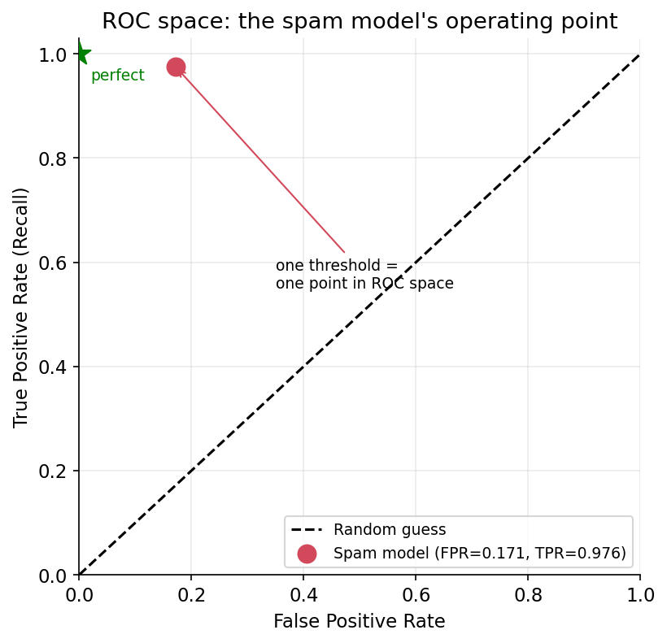

*The spam filter's single operating point (red), against the random-guess diagonal and the perfect-classifier corner (green star). One threshold = one dot; to draw the whole curve you need predicted scores at many thresholds — which is why ROC uses `predict_proba`, not hard labels.*

**ROC-AUC (Area Under the Curve)** collapses the whole curve into one number: **0.5 = random guessing, 1.0 = perfect separation.** AUC also has an exact and elegant meaning: *it is the probability that a randomly chosen positive example receives a higher score than a randomly chosen negative example.* In other words, AUC measures how well the model **ranks** positives above negatives, independent of any specific threshold.

> **Learn more.** That "probability a random positive outranks a random negative" statement is not a loose analogy — it is an exact identity. AUC is algebraically equivalent to the normalised **Wilcoxon–Mann–Whitney** rank-sum statistic, which makes it a *non-parametric* measure of rank discrimination: it depends only on the **ordering** of your scores, never on their actual values. This is why AUC is unchanged if you pass scores through any monotonic transformation, and why a model can have excellent AUC while being badly *calibrated* (its "0.9" may not mean a real 90% chance).

**Interpretation shortcut:** ROC-AUC answers "How well does the model order positives above negatives?" It does **not** choose your production threshold for you.

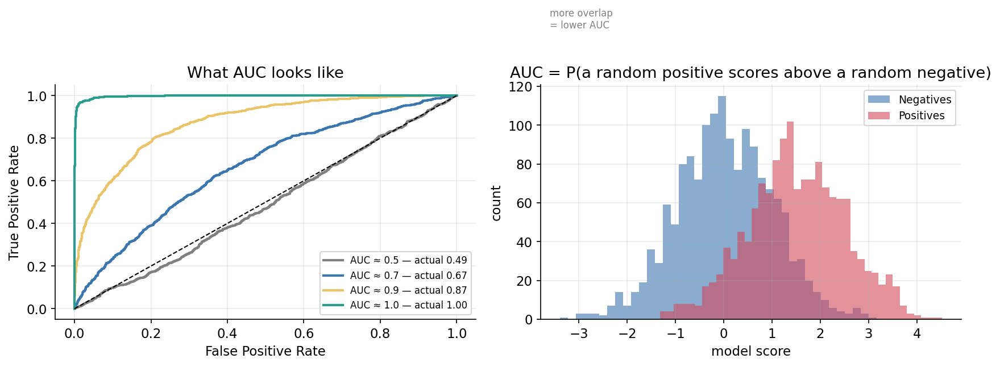

*Making AUC concrete. **Left:** four models from useless to perfect. The diagonal is coin-flipping (AUC 0.5); the closer a curve bends into the top-left corner, the better it ranks. **Right:** the same story told as score distributions. AUC is really a statement about **overlap** — when the positive and negative score histograms sit right on top of each other, AUC collapses toward 0.5; when they pull apart cleanly, AUC approaches 1.0. Separation *is* the whole game.*

### 11.2 The precision–recall curve

The **precision–recall (PR) curve** plots precision (y) against recall (x) as the threshold varies. It typically slopes downward: pushing recall higher (catching more positives) usually costs precision. Its area under the curve depends heavily on how imbalanced the data is.

### 11.3 Which curve, when?

| Curve | Best suited for | Why |
|---|---|---|
| **ROC** | Balanced classes (or when both classes are equally important) | Weighs performance on both classes symmetrically |
| **Precision–Recall** | Imbalanced classes | Focuses on positive-class quality (e.g. the 1%-disease case) |

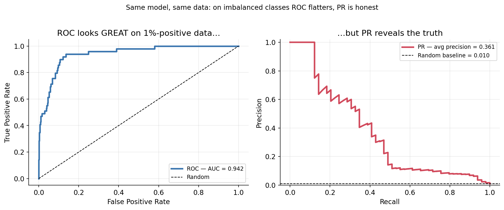

*This is the single most important plot in the section, and it is worth staring at. **Both panels show the identical model on the identical data** — 5,000 cases of which just 1% are positive, our disease-detection scenario. The ROC curve on the left reports **AUC = 0.942** and looks like a triumph. The PR curve on the right reports **average precision = 0.361** and looks like a problem. The PR curve is the honest one. The reason is the false-positive rate's denominator: with 4,950 negatives available, even hundreds of false alarms barely register as a fraction, so ROC stays flattered. Precision has no such cushion — it counts those false alarms directly against you. **If someone shows you a great AUC on rare-event data, ask to see the PR curve.***

**Computing them in code:**

```python
from sklearn.metrics import roc_auc_score, roc_curve, precision_recall_curve

# NOTE: these take PROBABILITIES, not hard labels.
# For binary problems, use the probability of the positive class = column 1.
scores = lr.predict_proba(X_test)[:, 1]

print("ROC-AUC:", roc_auc_score(y_test, scores))     # single-number summary

fpr, tpr, thresholds = roc_curve(y_test, scores)      # points to plot the ROC curve
prec, rec, thresholds = precision_recall_curve(y_test, scores)  # points for the PR curve
```

### 11.4 Beyond curves: the business decision

Curves show performance across *all* thresholds, but in production you must commit to *one* threshold — and the right one depends on the **relative cost** of false positives versus false negatives. If flagging a churn risk triggers an expensive retention offer, you weigh the cost of that offer against the revenue lost if the customer leaves. Once costs pin down a specific threshold, the metrics *at that threshold* (a single precision, recall, or F1) may matter more than the full curve.

---

## 12. Metrics for multi-class problems

> **Where we are.** All those metrics were defined for two classes. Back to the six activities: here is how the same ideas extend when there are many classes.

With more than two classes, the confusion matrix grows to $K \times K$ (e.g. $6\times 6$ for the six activities). The diagonal is still "correct," and accuracy is still "diagonal sum ÷ total." But precision, recall, and F1 are defined per *positive* class, so for multi-class we compute them **one class at a time** (one-vs-rest) and then **average**. There are three averaging strategies, and the choice is not cosmetic:

| Averaging | How it works | Use when |
|---|---|---|
| **Macro** | Plain average across classes (every class counts equally) | All classes matter equally, *especially rare ones* |
| **Weighted** | Average weighted by each class's number of samples | You want the score to reflect real-world class frequencies |
| **Micro** | Pool all TP/FP/FN across classes first, then compute | Dominated by frequent classes; in single-label multi-class settings, micro-precision = micro-recall = micro-F1 = accuracy |

**Rule of thumb:** on **imbalanced** data, **macro-F1** is often the most honest single summary, because it refuses to let a large majority class hide poor performance on a small but important minority class. Weighted-F1 can look reassuringly high mainly because large classes dominate the weighted average.

**Memory trick:**
- **Macro** = every class gets one equal vote.
- **Weighted** = bigger classes get louder votes.
- **Micro** = treat every prediction across all classes as one global pool.

```python
from sklearn.metrics import f1_score
f1_score(y_test, y_pred, average='macro')      # every class weighted equally
f1_score(y_test, y_pred, average='weighted')   # weighted by class frequency
```

The confusion matrix is also more informative here: it shows *exactly which pairs of classes get confused*. In the activity-recognition lab, for instance, **Sitting** and **Standing** are frequently mixed up — physically sensible, because a phone's sensors read nearly the same in both still postures.

---

## 13. Choosing the right metric

> **Where we are.** We now own a full toolbox of metrics. This short section is the decision rule for reaching for the right one — and the capstone (Section 16) turns it into real judgement.

There is no universal "best" metric — the right choice flows from the problem:

- **Balanced classes, both errors equally costly?** Accuracy and ROC-AUC are reasonable.
- **Imbalanced classes?** Prefer precision, recall, F1, and the precision–recall curve. Avoid leaning on raw accuracy.
- **Missing a positive is expensive (disease, fraud)?** Prioritize **recall** — you would rather over-flag than miss a true case.
- **False alarms are expensive (spam filter deleting real mail)?** Prioritize **precision**.
- **Need one balanced number?** Use **F1** (macro-F1 if imbalanced).
- **Comparing rankers independent of threshold?** Use **ROC-AUC** (balanced) or **PR-AUC** (imbalanced).

Always tie the metric back to the real-world cost of each kind of mistake. The math serves the decision, not the other way around.

> **This is the short version.** Section 16 — the closing section of this guide — works this reasoning through properly on real scenarios (cancer screening, spam, fraud, hiring, loan decisions), shows you how to *compute* the cost-optimal threshold rather than guess it, and explains why 0.5 was never the neutral choice you assumed. If you read only one section for practical use, read that one.

---

## 14. Key takeaways

1. **Classification predicts categories; regression predicts quantities.** Look at the target to tell them apart.
2. **Linear regression fails as a classifier** because its output is unbounded and easily distorted; the **sigmoid** fixes both by squashing outputs into (0, 1).
3. **Logistic regression models the log-odds as a linear function** of the features, which keeps coefficients interpretable: $\beta_j$ is the change in log-odds per unit of $x_j$.
4. Its **decision boundary is always linear** — a point, line, or hyperplane.
5. Extend to many classes with **one-vs-rest** or **multinomial (softmax)**.
6. The `scikit-learn` recipe is **import → instantiate → fit → predict**, with `.predict()` for labels and `.predict_proba()` for probabilities.
7. **Regularization (L1/L2/Elastic-Net)** curbs overfitting; remember `C = 1/λ`, so *smaller `C` means stronger penalty*.
8. **Accuracy is misleading on imbalanced data.** Read the **confusion matrix** and use **precision, recall, specificity, and F1**.
9. **ROC and precision–recall curves** summarize performance across all thresholds; **AUC** measures ranking quality.
10. For **multi-class**, compute metrics per class and **average** (macro for fairness to rare classes); the confusion matrix reveals *which* classes get confused.

---

## 15. Glossary

- **Feature:** an input variable used to make a prediction (a column of `X`).
- **Label / target:** the thing being predicted (the vector `y`).
- **Sigmoid / logistic function:** $\sigma(z) = 1/(1+e^{-z})$, squashes any number into (0, 1).
- **Odds:** $p/(1-p)$, the ratio of success probability to failure probability.
- **Log-odds / logit:** the natural log of the odds; modeled as a linear function of the features.
- **Decision boundary:** the surface where the model is exactly undecided ($p = 0.5$).
- **Regularization:** a penalty on large coefficients to reduce overfitting (L1, L2, Elastic-Net).
- **`C`:** scikit-learn's regularization knob; the inverse of penalty strength ($C = 1/\lambda$).
- **Confusion matrix:** a table of true vs. predicted classes (TP, FP, FN, TN).
- **Precision:** $TP/(TP+FP)$ — reliability of positive predictions.
- **Recall / sensitivity:** $TP/(TP+FN)$ — fraction of true positives captured.
- **Specificity:** $TN/(TN+FP)$ — recall for the negative class.
- **F1-score:** harmonic mean of precision and recall.
- **ROC curve / AUC:** true-positive vs. false-positive rate across thresholds; AUC = ranking quality (0.5 random, 1.0 perfect).
- **Stratified split:** a train/test split that preserves each class's proportion.
- **One-vs-Rest (OvR):** $K$ binary classifiers, one per class vs. all others.
- **Multinomial / softmax:** a single joint model whose class probabilities sum to 1.

---

## 16. Practical decision guide: when errors cost different amounts

Everything so far has been machinery. This closing section is about **judgement** — how a practitioner actually decides what to optimize on a real problem. There is no code here on purpose. This is the reasoning that should happen *before* anyone opens a notebook.

### 16.1 The idea that reframes everything

Return to the threshold. All this time we predicted "positive" when $p > 0.5$. It feels neutral, like a law of nature. It is not.

**A threshold of 0.5 is a claim that a false positive and a false negative cost exactly the same.**

That claim is almost never true. Missing a tumour is not equivalent to a needless follow-up scan. Deleting a job offer as spam is not equivalent to letting one junk email through. The moment the costs differ, 0.5 stops being neutral and starts being *wrong* — and it is wrong silently, which is worse.

So the real question is never "what's my accuracy?" It is: **which mistake can I least afford, and what am I willing to pay to avoid it?**

### 16.2 Five questions to ask before choosing a metric

1. **What actually happens when the model says "positive"?** A prediction is not a decision. Does it delete an email, decline a payment, or just add a name to a review queue? The *action* determines the cost far more than the model does.
2. **What does each error cost — in money, time, or harm?** Try to put real numbers on it. "A false negative costs about 20× a false positive" is enough; you do not need precision to two decimals.
3. **How rare is the positive class?** Rare positives mean ROC will flatter you (§11.3). Use precision–recall.
4. **Can I avoid making a hard decision at all?** Often the best engineering move is to soften the action rather than tune the model — see 16.4.
5. **Will I have to explain this decision to someone?** If yes, interpretability is a *constraint*, not a preference — see 16.6.

### 16.3 The cost-optimal threshold

You can do better than guessing. Suppose a false positive costs $C_{FP}$ and a false negative costs $C_{FN}$, and your model gives a probability $p$ that the case is positive. Compare the two expected costs:

- If you **predict positive**, you are wrong only when the case is truly negative — expected cost $(1-p)\, C_{FP}$.
- If you **predict negative**, you are wrong only when the case is truly positive — expected cost $p\, C_{FN}$.

Predict positive whenever it is the cheaper option:

$$(1-p)\,C_{FP} < p\,C_{FN}$$

Expanding and collecting the $p$ terms gives $C_{FP} < p\,(C_{FN} + C_{FP})$, and therefore:

$$\boxed{\; \text{predict positive when } \; p > t^* = \frac{C_{FP}}{C_{FP} + C_{FN}} \;}$$

This little formula carries three lessons:

- **Equal costs give $t^* = 0.5$.** The familiar default falls out as the *special case* where the two errors are equally bad. That is the hidden assumption, made explicit at last.
- **If a miss is 20× worse than a false alarm** (cancer), $t^* = \tfrac{1}{1+20} \approx 0.048$ — flag anyone above a 5% chance.
- **If a false alarm is 20× worse than a miss** (spam), $t^* = \tfrac{20}{20+1} \approx 0.952$ — only act when almost certain.

Notice you never needed the ratio's exact value, only its rough magnitude. Getting from "these costs are wildly different" to "so the threshold should be nowhere near 0.5" is most of the benefit.

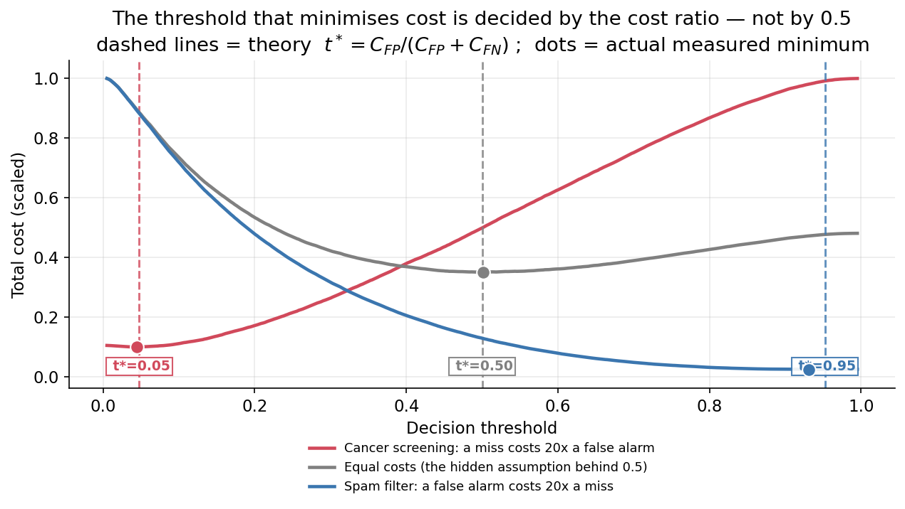

*The formula, verified. Each curve is the total cost of a real classifier as the threshold sweeps from 0 to 1, under three different cost ratios. The dashed lines are the theoretical $t^*$; the dots are where the cost actually bottoms out — they agree. Follow the grey curve (equal costs) and the minimum sits at 0.5, right where habit expects. But shift the cost ratio and the optimum slides dramatically: to 0.05 for cancer screening, to 0.95 for spam. **The same model, on the same data, has three different correct thresholds** — because "correct" was never a property of the model. It is a property of what the mistakes cost you.*

> **Learn more.** $t^*$ assumes the model's "0.7" really means a 70% chance. That property is called **calibration**, and logistic regression is usually reasonably well-calibrated (it optimizes log-loss, which rewards honest probabilities). Many models are not — a random forest's "0.9" may mean nothing of the sort. If you are unsure, either calibrate the model first (Platt scaling, isotonic regression) or skip the formula and just pick the threshold empirically: sweep it on a validation set and take the value that minimises your actual cost. Recall too that AUC is **blind** to calibration (§11.1), so a great AUC is no evidence your probabilities are trustworthy.

### 16.4 How to state a real target: optimize one thing, constrain the other

Teams rarely say "maximize F1." They say something sharper, in this shape:

> **Maximize the metric I care about, subject to keeping the other one above a level I can survive.**

That phrasing forces the cost conversation into the open:

- **Cancer screening:** *maximize recall, subject to precision staying high enough that the follow-up clinic can absorb the referrals.* Recall is the goal; precision is the budget.
- **Spam filter:** *maximize recall, subject to a false-positive rate below roughly 1 in 1,000.* Catching spam is the goal; not eating real mail is the non-negotiable constraint.
- **Fraud:** *maximize recall, subject to declining no more than X% of legitimate transactions.*

The constraint is where the honesty lives — it is the quantified answer to "what cost can we bear?" A model that hits the target metric while violating the constraint has not succeeded; it has moved the damage somewhere the metric could not see.

### 16.5 Scenarios worked through

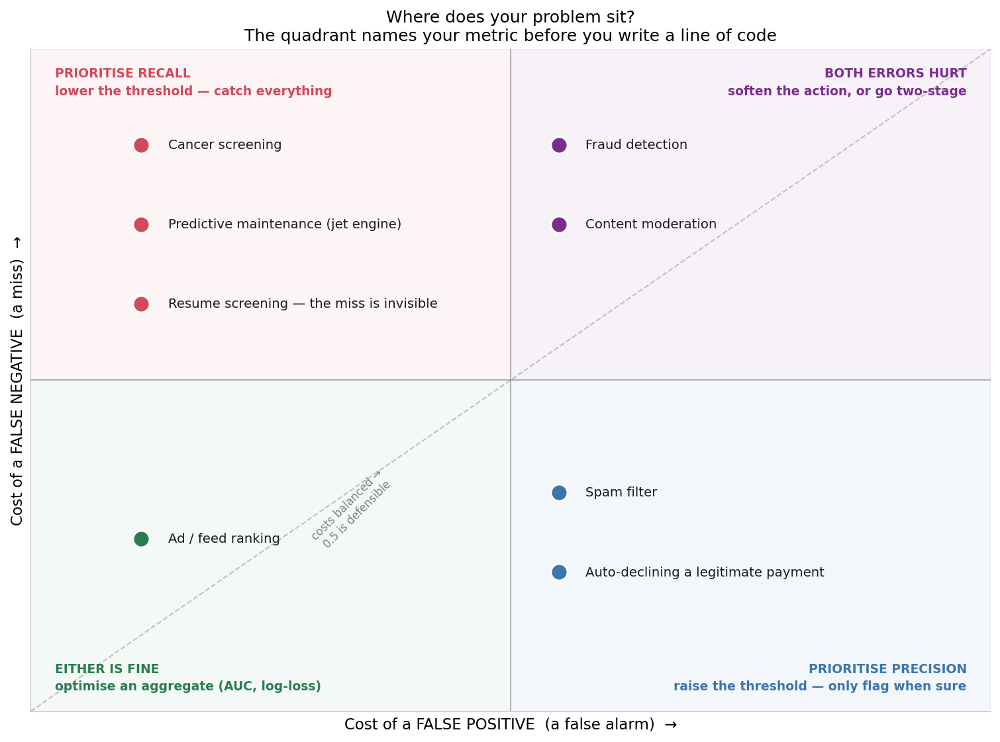

*Nearly every classification problem lands in one of these four quadrants, and the quadrant tells you the answer before you fit anything. Read your problem's position on the two axes and the metric follows.*

**Cancer detection — the miss is the catastrophe.**
A false negative sends someone home with an untreated, progressing disease. A false positive causes fear and an unnecessary follow-up test — real harms, but recoverable ones. The costs are wildly asymmetric, so: **prioritize recall (sensitivity)**, push the threshold far below 0.5, and accept that most of what you flag will turn out to be nothing. The metric to report is *recall at an acceptable precision*, read off a precision–recall curve — not accuracy, and not ROC, since disease prevalence is low (§11.3). Note how real medicine already encodes this: a screening test is deliberately tuned for high sensitivity, and anything it flags goes to a more specific confirmatory test. Which leads to the most useful trick in this whole section…

**…the two-stage cascade.** When you cannot get both recall and precision from one model, **stop trying**. Use a cheap, high-recall model to shrink the population, then an expensive, high-precision one (or a human) to clean up what survives. Stage 1 refuses to miss; stage 2 refuses to be wrong. This is how screening → biopsy works, how spam pre-filters feed heavier classifiers, how resume screening should work. Two mediocre models chained sensibly beat one heroic model.

**Spam filtering — the false alarm is the catastrophe.**
Flip the asymmetry. A false negative means junk in your inbox; you delete it in a second. A false positive means a job offer or invoice silently vanishes — and unlike the spam you can see, **you never find out it happened**. So: **prioritize precision** and raise the threshold; only act when the model is nearly certain. But notice the deeper move: mail providers do not *delete* suspected spam, they put it in a folder you can search. That single design decision converts an invisible, irreversible error into a visible, recoverable one — and collapses the cost of a false positive. **They engineered the cost down instead of tuning the model up.** Always ask whether you can do the same.

**Fraud detection / declining a payment — both errors are expensive.**
A false negative is a chargeback. A false positive declines a real customer's card at checkout — lost sale, humiliation, and a customer who may never return. Neither is cheap, so no threshold is comfortable. The escape is again to stop treating it as a binary decision: use **three bands**. Low probability → allow. High → block. In the wide middle → *challenge* (a one-time passcode, a verification prompt). The middle band is where a hard decision would have been most likely wrong, so you decline to make one and ask for more information instead. Whenever both errors hurt, look for a third action.

**Predictive maintenance — a miss can kill.**
A false positive on a jet engine is an unnecessary inspection: expensive, annoying, survivable. A false negative is an in-flight failure. The ratio is so lopsided the model is barely the point — you flag on the faintest signal and eat the inspection costs. Any threshold reasoning that starts near 0.5 has misunderstood the problem.

**Resume screening — the error you cannot see.**
A false positive advances a mediocre candidate to interview: costs an hour. A false negative rejects someone excellent — and here is the trap: **you never learn it happened.** They are gone; there is no feedback, no ticket, no metric. Your dashboard will look flawless while the model quietly does its worst damage. The lesson generalises: **when one error is systematically unobservable, your metrics are biased toward the error you *can* see.** Ask, on every project, which mistakes are invisible to your data — and expect no dashboard to warn you.

**Content moderation — where math runs out.**
A false positive removes legitimate speech; a false negative leaves harmful content up. Both costs are real, contested, and *not commensurable* — they cannot be converted into a common currency and compared. There is no $t^*$ here, because $C_{FP}$ and $C_{FN}$ are not numbers people agree on. This is worth stating plainly: the framework in this section tells you how to act **once you have decided what you value**. It cannot decide what to value. When someone presents a threshold as a purely technical choice, they are usually smuggling in a values judgement — and the most useful thing you can do is drag it into the open where it can be argued about honestly.

### 16.6 Interpretation vs. prediction: two opposite problems

A different axis entirely — not "which error is worse" but "what is the model *for*". Two deliberately opposite cases:

**Denying someone a loan — you must be able to explain it.**
If you decline an application, regulation in many jurisdictions obliges you to state *why*, in specific terms ("your debt-to-income ratio and two recent delinquencies"). Logistic regression hands you this directly: each coefficient is a readable statement about odds (§4). Now suppose gradient boosting scores two points better on AUC but cannot produce a defensible reason. **The right call may be to ship the less accurate model** — because an unexplainable decision is not merely awkward here, it is unusable. Accuracy is not the objective; *defensible* accuracy is. Interpretability is a hard constraint, and the correct posture is: maximize accuracy **subject to** every decision being explainable.

**Ranking ads or feed items — nobody is owed an explanation.**
No user asks why item #4 outranked item #5, and no regulator requires an answer. Interpretability is worth approximately nothing, while a 0.3% AUC gain may be worth millions. Use whatever wins. Ship the black box without a second thought.

Same mathematics, opposite priorities — and the difference has nothing to do with the data.

**A subtler version of the same split: inference vs. prediction.** These sound alike and are not:

- **Prediction** asks *"which customers will churn?"* You care about out-of-sample accuracy (*out-of-sample* = performance on fresh data the model was not trained on). You do not care whether a coefficient is biased, and you will happily use `scikit-learn` with heavy regularization.
- **Inference** asks *"does raising the price cause churn, and by how much?"* Now the **coefficient itself is the deliverable** — you need it unbiased, with a confidence interval and a p-value. This is `statsmodels` territory (§4).

And here is the sting, which ties back to §8: **regularization deliberately biases coefficients toward zero.** That is a bargain worth making for prediction — you trade a little bias for a lot less variance. But it makes a regularized model a *poor instrument for inference*, because you have knowingly shrunk the very number you are trying to measure. A model can be excellent at prediction and actively misleading for inference. Know which question you are answering before you pick the tool.

### 16.7 Summary

| Scenario | Costlier error | Optimize | Threshold | Report |
|---|---|---|---|---|
| Cancer / disease screening | False negative (a miss) | **Recall** | Well below 0.5 | Recall at acceptable precision; PR curve |
| Predictive maintenance | False negative | **Recall** | Very low | Recall; cost of missed failure |
| Spam filtering | False positive (lost real mail) | **Precision** | Well above 0.5 | Precision; false-positive rate |
| Auto-declining a payment | False positive | **Precision** | High | Precision; % of good customers declined |
| Fraud detection | Both | Recall **subject to** a decline-rate cap | Banded (allow / challenge / block) | Both, plus the challenge rate |
| Ad / feed ranking | Neither, much | Aggregate (**AUC**, log-loss) | Whatever ranks best | AUC |
| Loan approval | Both — *plus* explainability | Accuracy **subject to** explainability | Cost-driven | Metrics **and** reason codes |

### 16.8 Five traps to avoid

1. **Treating 0.5 as neutral.** It is a cost assumption in disguise. Say it out loud and check whether you believe it.
2. **Reporting accuracy on imbalanced data.** It will look wonderful and mean nothing (§9).
3. **Trusting a good AUC on rare events.** Ask for the precision–recall curve (§11.3, and look again at that figure).
4. **Tuning the model when you should redesign the action.** The spam folder beat every classifier tweak. Can you make the error recoverable, reversible, or reviewable instead?
5. **Optimizing an error you can measure while ignoring one you cannot.** The invisible mistake is usually the expensive one.

### 16.9 The one thing to remember

> A metric is not a mathematical preference. It is a statement about **whose mistake this is, and what it costs them**. Choose it before you fit the model, justify it in the language of the problem rather than the language of statistics, and be able to say out loud what you are choosing to get wrong — because you *are* choosing.

---

## 17. Self-check questions

Try to answer these from memory after the capstone; then check yourself against the sections noted.

1. Give one real-world example each of a regression and a classification problem. *(§1)*
2. State the two reasons linear regression is a poor classifier, and how the sigmoid addresses each. *(§2–3)*
3. What is $\sigma(0)$, and why is that value meaningful? *(§3)*
4. If a coefficient is $\beta_1 = 0.7$, what happens to the odds when $x_1$ increases by one unit? *(§4)*
5. A dataset is 95% class A, 5% class B. A model scores 95% accuracy. Why might it still be worthless, and which metrics would reveal the problem? *(§9–10)*
6. You care most about *never missing* a fraudulent transaction. Do you optimize precision or recall? *(§10, §13)*
7. In `scikit-learn`, does a *smaller* `C` mean more or less regularization? *(§8)*
8. What does an ROC-AUC of 0.5 mean? Of 1.0? *(§11)*
9. On imbalanced multi-class data, why is macro-F1 often preferred over weighted-F1? *(§12)*
10. Which metrics require `predict_proba` rather than `predict`? *(§10–11)*

*Next: work through the two companion lab guides — the **Human Activity Recognition** lab (`Guide01_lab_human-activity-recognition.md`) and the **Clinical Nutrition** case study (`Guide02_lab_clinical-nutrition-multinomial.md`) — to apply every idea here to real data.*

*This reading guide is prepared by Souvik Mandal, 2026 to accompany course materials originally structured by Machine Learning Foundation © IBM Corporation.*
